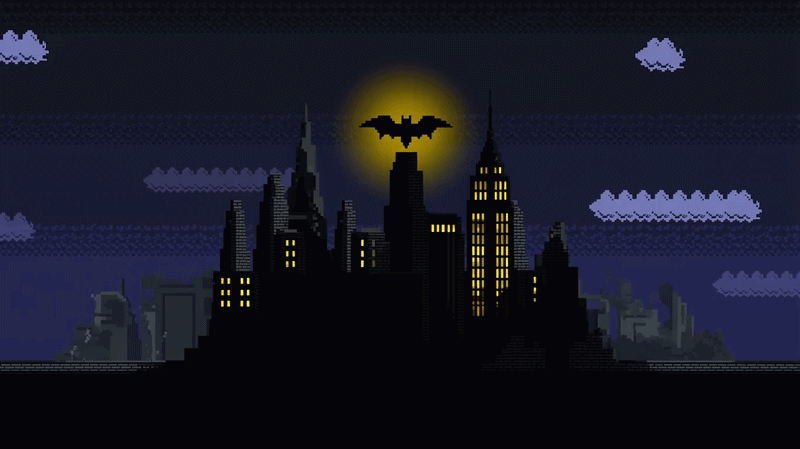

 

---

## 🦇 THE DEVELOPER BEHIND THE SIGNAL

I'm a Computer Engineering student who builds **practical solutions** across software, systems, hardware, and design.
Some heroes have gadgets. I have a keyboard, a Git history, and a lot of coffee.

---

## ⚙️ THE UTILITY BELT

 

  

---

## 🧠 THE BAT-COMPUTER

 

 

---

## 🦇 ENTER MY WORLD

 

  

### *"It's not who I am underneath, but what I build that defines me."*

**THE CITY NEVER SLEEPS. NEITHER DOES THE CODE.**

